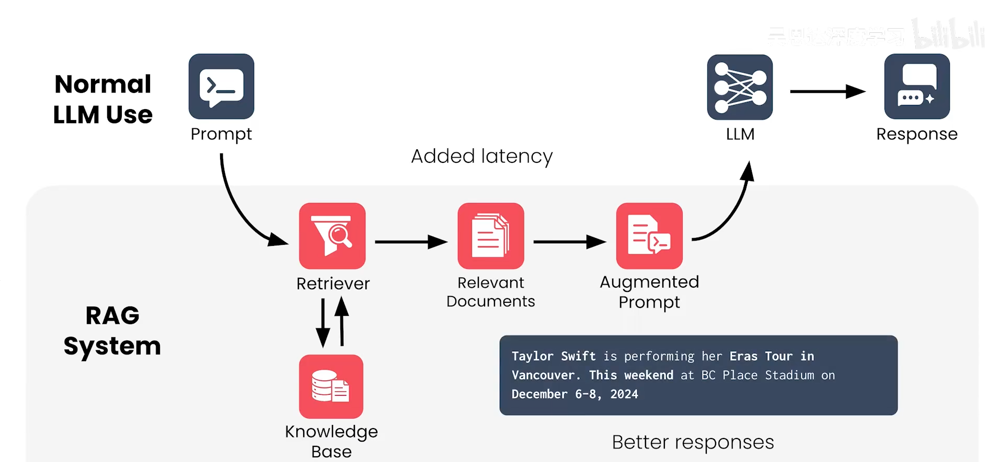

# RAG 学习笔记

## 核心概念

RAG（Retrieval-Augmented Generation，检索增强生成）通常由两部分组成：

- 检索：从外部知识库（文本、PDF、网页、数据库等）检索与问题相关的片段
- 生成：将检索到的片段作为上下文喂给大模型，生成更准确、可追溯的回答

## 为什么要用 RAG

- 降低幻觉：回答依赖可检索到的资料片段
- 降低成本：更新知识库即可，不必频繁微调/重训
- 提高时效性：知识更新快的场景更适合

补充：回答相同问题时，中文回复往往消耗更少的 token。

## 工作流程

